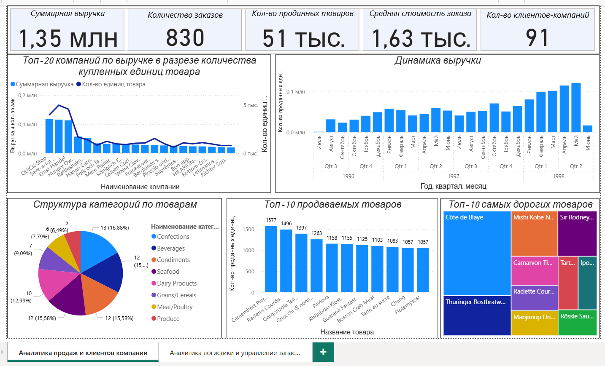
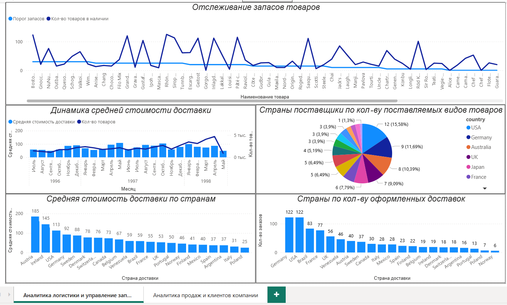

# Nordwind — Sales & Logistics Analytics

**Tools:** SQL · PostgreSQL · Power BI

## Overview

BI-проект по комплексному анализу продаж, клиентов и логистики на основе базы данных Northwind.

Цель проекта – разработка аналитического дашборда для визуализации ключевых показателей компании, анализа динамики выручки и продаж, структуры товарного ассортимента, клиентской базы и характеристик поставок.

## Dashboard

Дашборд состоит из двух аналитических разделов: **«Аналитика логистики и управление запасами»** и **«Аналитика продаж и клиентов компании»**.

### Sales & Customer Analytics

В разделе представлены:

- ключевые показатели продаж: суммарная выручка, количество заказов, количество проданных товаров, средняя стоимость заказа и количество клиентов-компаний
- анализ крупнейших компаний по выручке и объёму приобретённых товарных единиц
- динамика выручки по месяцам и кварталам
- структура товарных категорий
- анализ наиболее продаваемых товаров
- выявление наиболее дорогих товаров

### Logistics & Inventory Analytics

В разделе представлены:

- мониторинг количества товаров в наличии относительно установленного порога запасов
- динамика средней стоимости доставки и количества доставленных товаров
- анализ стран-поставщиков по количеству поставляемых видов товаров
- сравнение средней стоимости доставки по странам
- анализ количества оформленных доставок по странам

## Key Metrics

- Total Revenue 
- Number of Orders
- Number of Products Sold 
- Average Order Cost
- Number of Corporate Clients

## Analysis

В рамках проекта проведены подготовка и структурирование данных, расчёт ключевых показателей и разработка интерактивных визуализаций для комплексного анализа продаж, товарного ассортимента, клиентской базы и логистики.

## Skills Demonstrated

`SQL` `PostgreSQL` `Power BI` `Data Analysis` `Data Visualization` `Business Intelligence`

## Project Type

Academic project
